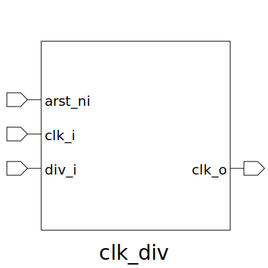

# clk_div (module)

### Author : Foez Ahmed (foez.official@gmail.com)

## TOP IO

## Description
 Write a markdown documentation for this systemverilog module:
 This file is part of squared-studio : testing
 **Copyright (c) 2025 squared-studio**
 **Licensed under the MIT License**
 **See LICENSE file in the repository root for full license information**

## Parameters
|Name|Type|Dimension|Default Value|Description|
|-|-|-|-|-|
|DIV_WIDTH|int||4||

## Ports
|Name|Direction|Type|Dimension|Description|
|-|-|-|-|-|
|arst_ni|input|logic||active low asynchronous reset|
|clk_i|input|logic||input clock|
|div_i|input|logic [DIV_WIDTH-1:0]||input clock divider|
|clk_o|output|logic||output clock|
