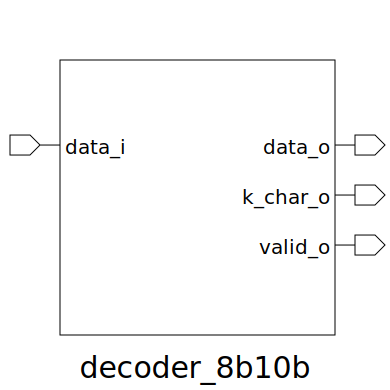

# decoder_8b10b (module)

### Author : Foez Ahmed (foez.official@gmail.com)

## TOP IO

## Description
 The decoder_8b10b module is a combinational logic block designed to decode 10-bit input data
 (data_i) into its corresponding 8-bit representation (data_o), adhering to a specific subset of
 the 8b/10b encoding scheme. It also provides a valid_o signal to indicate if the input 10-bit
 code is a recognized valid code.

 **This file is part of squared-studio : hardware**
 **Copyright (c) 2026 squared-studio**
 **Licensed under the MIT License**
 **See LICENSE file in the repository root for full license information**

## Parameters
|Name|Type|Dimension|Default Value|Description|
|-|-|-|-|-|

## Ports
|Name|Direction|Type|Dimension|Description|
|-|-|-|-|-|
|data_i|input|logic [9:0]|| 10-bit input data to be decoded (8b/10b encoded symbol)|
|data_o|output|logic [7:0]|| 8-bit decoded output data|
|k_char_o|output|logic [7:0]|| control character flasg: '1' if data_o is K char, '0' otherwise|
|valid_o|output|logic|| Output validity flag: '1' if data_i is a valid 8b/10b code, '0' otherwise|
