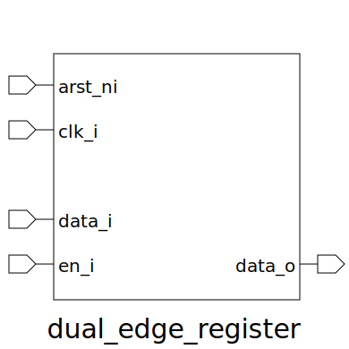

# dual_edge_register (module)

### Author : 

## TOP IO

## Description
 Dual-edge storage using two edge flops and a clock-level mux on the output.

## Parameters
|Name|Type|Dimension|Default Value|Description|
|-|-|-|-|-|
|WIDTH|int||8|Width of the register|

## Ports
|Name|Direction|Type|Dimension|Description|
|-|-|-|-|-|
|arst_ni|input|logic||active low asynchronous reset|
|clk_i|input|logic||input clock|
|data_i|input|logic [WIDTH-1:0]||data input|
|en_i|input|logic||enable signal for capturing data|
|data_o|output|logic [WIDTH-1:0]||data output|
