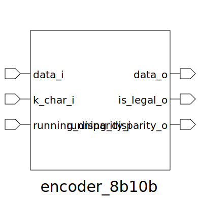

# encoder_8b10b (module)

### Author : Foez Ahmed (foez.official@gmail.com)

## TOP IO

## Description
 Description: This module implements an 8b/10b encoder as per the 8b/10b encoding scheme. It takes
 an 8-bit data input, a control character indicator, and the current running disparity, and
 outputs a 10-bit encoded data, a legality indicator, and the updated running disparity.
 -------------------------------------------------------------------------------------------------
 **This file is part of squared-studio : hardware**
 Copyright (c) 2026 squared-studio
 **Licensed under the MIT License**
 **See LICENSE file in the repository root for full license information**

## Parameters
|Name|Type|Dimension|Default Value|Description|
|-|-|-|-|-|

## Ports
|Name|Direction|Type|Dimension|Description|
|-|-|-|-|-|
|data_i|input|logic [7:0]|| 8-bit input data to be encoded|
|k_char_i|input|logic|| Control character indicator (1 for K-character, 0 for D-character)|
|running_disparity_i|input|logic|| Current running disparity (0 for RD-, 1 for RD+)|
|data_o|output|logic [9:0]|| 10-bit encoded output data|
|is_legal_o|output|logic|| Indicates if the input combination is legal (1 for legal, 0 for illegal)|
|running_disparity_o|output|logic|| Updated running disparity after encoding (0 for RD-, 1 for RD+)|
