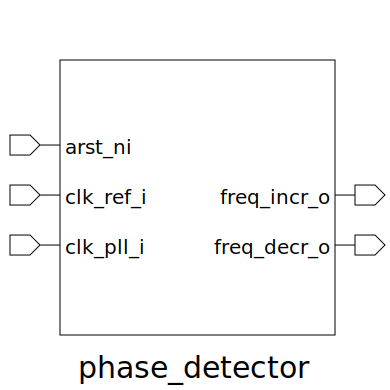

# phase_detector (module)

### Author : Foez Ahmed (foez.official@gmail.com)

## TOP IO

## Description
 Write a markdown documentation for this systemverilog module:
 **This file is part of squared-studio : hardware**
 Copyright (c) 2026 squared-studio
 **Licensed under the MIT License**
 **See LICENSE file in the repository root for full license information**

## Parameters
|Name|Type|Dimension|Default Value|Description|
|-|-|-|-|-|

## Ports
|Name|Direction|Type|Dimension|Description|
|-|-|-|-|-|
|arst_ni|input|logic||Asynchronous reset, active low|
|clk_ref_i|input|logic||Reference clock input|
|clk_pll_i|input|logic||PLL clock input|
|freq_incr_o|output|logic||Output signal indicating frequency increase needed|
|freq_decr_o|output|logic||Output signal indicating frequency decrease needed|
