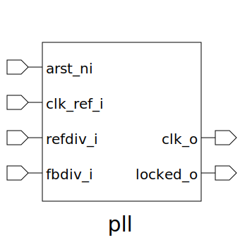

# pll (module)

### Author : Foez Ahmed (foez.official@gmail.com)

## TOP IO

## Description
 **This file is part of squared-studio : hardware**
 **Copyright (c) 2026 squared-studio**
 **Licensed under the MIT License**
 **See LICENSE file in the repository root for full license information**

## Parameters
|Name|Type|Dimension|Default Value|Description|
|-|-|-|-|-|
|REF_DEV_WIDTH|int||4||
|FB_DIV_WIDTH|int||8||

## Ports
|Name|Direction|Type|Dimension|Description|
|-|-|-|-|-|
|arst_ni|input|logic|||
|clk_ref_i|input|logic|||
|ref_div_i|input|logic [REF_DEV_WIDTH-1:0]|||
|fb_div_i|input|logic [ FB_DIV_WIDTH-1:0]|||
|clk_o|output|logic|||
|locked_o|output|logic|||
