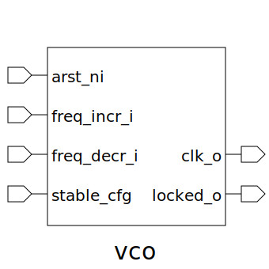

# vco (module)

### Author : 

## TOP IO

## Description

## Parameters
|Name|Type|Dimension|Default Value|Description|
|-|-|-|-|-|
|MIN_FREQ_HZ|real||100E3|100 kHz|
|MAX_FREQ_HZ|real||10E9|10 GHz|
|RESOLUTION_BITS|int||20|20-bit resolution for frequency control word|

## Ports
|Name|Direction|Type|Dimension|Description|
|-|-|-|-|-|
|voltage_ctrl_i|input|logic [RESOLUTION_BITS-1:0]||Control voltage input for VCO|
|clk_o|output|logic||Output clock signal|
